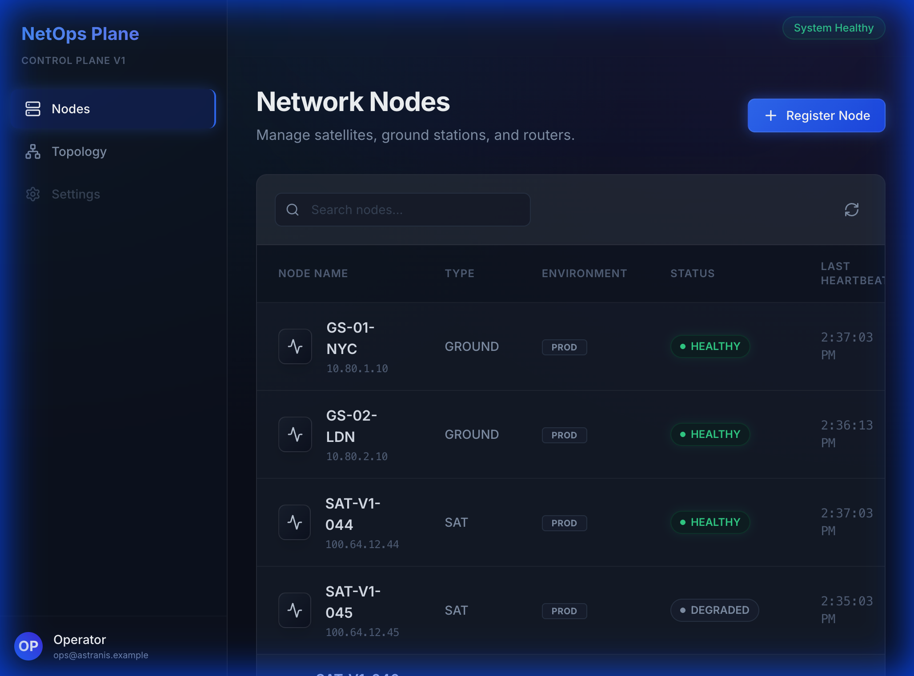
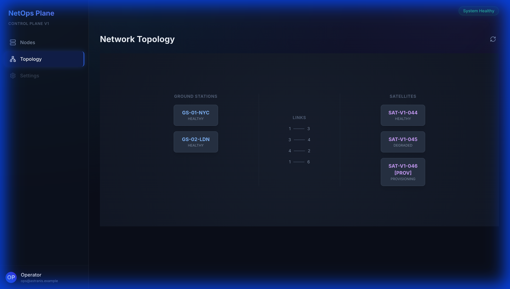
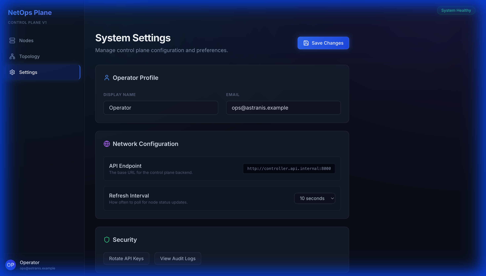

# Network Control Plane & Operations Dashboard

> ### Project Complete ✅
>
> The **Network Control Plane & Operations Dashboard** is now complete and fully verified.
>
> **Key Capabilities**
>
> * Backend control plane built with **Django + DRF**, backed by **PostgreSQL**, fully containerized with **Docker Compose**.
> * Core domain models for **Nodes, Topology Links, WorkflowRuns, and EventLogs**, modeling real infrastructure state and operations.
> * REST APIs supporting full CRUD, topology views, and operational metrics.
> * **Async infrastructure workflows** implemented with **Celery + Redis**, including node provisioning and automated stale-node detection.
> * **Operator-facing UI** built in **React + TypeScript**, featuring a dark-mode dashboard for node management and topology visibility.
> * **Observability features** including correlation IDs, structured logging, and system metrics.
>
> **Verification**
>
> * Full backend test suite passing (API, workflows, and state transitions).
> * Frontend linting and validation completed.
> * End-to-end walkthrough documented in `walkthrough.md`.
>
> **Running Locally**
>
> * Backend: `make up` (Postgres, Redis, Django on `:8000`)
> * Frontend: `cd frontend && npm run dev` (UI on `:5173`)
>
> This project is designed to resemble **production-grade network and infrastructure management software**, emphasizing correctness, observability, and operator usability.

## 🧠 Event-Driven Architecture (Kafka Backbone)

This project uses **Apache Kafka** as a central nervous system for lifecycle events, ensuring auditability and decoupling writes from downstream processing.

### Why Kafka?
*   **Immutable History**: Unlike Celery (which is for "tasks"), Kafka provides a replayable log of "what happened" (`NODE_CREATED`, `PROVISION_FAILED`). This allows us to rebuild the Audit Log or generate metrics from the beginning of time.
*   **Decoupling**: The API write path (Django) only needs to emit an event. multiple downstream consumers (Audit, Metrics, Notifications) can react independently without slowing down the user.
*   **Reliability**: Using Kafka's durability guarantees ensures critical control-plane history is never lost compared to ephemeral logs.

### Reliability Guarantees
We implement "At-least-once delivery" guarantees suitable for financial or critical infra systems:
1.  **Strict Producer**:
    *   `acks=all`: Ensure data is replicated to all ISRs before success.
    *   `enable.idempotence=true`: Prevent duplicate messages on network retries.
    *   **Post-commit publish**: We use `transaction.on_commit` hooks to ensure events are *only* published if the DB transaction commits successfully.
2.  **Idempotent Consumer**:
    *   **Manual Offsets**: We trigger `commit()` ONLY after the event is successfully written to the DB.
    *   **Idempotency Key**: The `AuditConsumer` checks `EventLog.objects.filter(event_id=...)` to prevent duplicate processing during re-drives.
3.  **Dead Letter Queue (DLQ)**:
    *   If a message fails to process (e.g., bad JSON, DB constraint), it is published to a `dlq` topic with full error metadata (traceback, timestamp) before the offset is committed. This prevents "poison pills" from blocking the pipeline.

### Known Limitations (Trade-offs)
*   **Dual-Write Edge Case**: We use `on_commit` hooks. If the process crashes *after* DB commit but *before* Kafka publish, the event is lost. A full "Transactional Outbox" pattern (DB Table -> Debezium -> Kafka) would solve this but was deemed over-engineering for this stage.
*   **Single Broker Dev**: Local docker uses a single Kafka broker with `replication-factor=1`. Production would use 3+ brokers with `min.insync.replicas=2`.

## 🔜 Resuming Work & Next Steps

This project is currently in a **Demonstration State** with the following characteristics:

1.  **Real Backend Active**: The frontend connects to the running Django backend.
    *   **Mock Disabled**: The development mock layer (`src/api/client.ts`) has been disabled to prove end-to-end connectivity.
2.  **Backend Status**: The Docker environment for the backend needs to be started. Ensure Docker Desktop is running and run `make up`.

### Demo Script (60 Seconds)

1.  **Start System**: `make up` (wait for health checks).
2.  **Create Node**: Go to Dashboard -> "New Node" -> Create "GS-DEMO-01".
3.  **Verify Kafka**:
    *   Run `python manage.py kafka_smoke_test --event-type=NODE_CREATED`
    *   Check Kafdrop (`http://localhost:9000`) -> Topic: `controlplane.node.events`.
4.  **Verify Audit**:
    *   Check "Audit Logs" in UI or query DB: `EventLog.objects.count()`.
5.  **Reliability**:
    *   Kill Consumer (`docker stop infra-backend-1`).
    *   Run Smoke Test.
    *   Start Consumer -> Verify event is processed (At-least-once).

**A control-plane backend to manage network nodes, topology links, and configuration workflows.**

This project acts as the central nervous system for a distributed network (satellites, ground stations, routers). It allows operators to provision nodes, visualize topology, and execute long-running maintenance workflows with full auditability.

## Architecture

```ascii
[Operator UI (React)]
       |
       v
[ Django API (DRF) ]  <--->  [ PostgreSQL (State) ]
       |
       +---> [ Celery Workers ] <---> [ Redis (Broker) ]
                   |
                   +---> [ Node Provisioning / Config ]
       +---> [ Kafka Producer ] ---> [ Kafka Cluster ]
                   |
                   +---> [ Audit Consumer ] ---> [ EventLog (DB) ]
```

## User Interface



*Figure 1: Node List Dashboard (showing live status of Ground Stations and Satellites)*



*Figure 2: Network Topology View (Visualizing links and node groups)*



*Figure 3: System Settings & Operator Config*

## Features

- **Node Management**: Register and track lifecycle of Ground Stations, Satellites, and Routers.
- **Topology**: Define and visualize links (RF, Fiber, VPN) between nodes.
- **Async Workflows**: Reliable provisioning and configuration application using Celery.
- **Observability**: Structured logging, correlation IDs, and event sourcing for audit trails.
- **Health Monitoring**: Heartbeat tracking with automated stale node detection.

## Tech Stack

- **Backend**: Django 5, Django REST Framework
- **Database**: PostgreSQL
- **Async Task Queue**: Celery + Redis
- **Frontend**: React + TypeScript
- **Infrastructure**: Docker Compose

## Running Locally

### Prerequisites
- Docker & Docker Compose
- Node.js (for frontend)

### Quick Start
1. **Start the backend stack**:
   ```bash
   make up
   ```
2. **Start the frontend**:
   ```bash
   cd frontend
   npm install
   npm run dev
   ```
3. **Access the App**:
   - Frontend: [http://localhost:5173](http://localhost:5173)
   - API Docs: [http://localhost:8000/api/docs/](http://localhost:8000/api/docs/)

## Design Decisions

- **Django + DRF**: Chosen for rapid iteration on complex data models.
- **Celery**: Handles long-running provisioning tasks that would time out a synchronous HTTP request.
- **Event Sourcing (Lite)**: An `EventLog` append-only stream serves as an audit trail.
- **Correlation IDs**: Distributed tracing simplified; every task and log shares a request ID.
- **Stale Node Detection**: A periodic background task (Celery Beat) assumes a node is UNREACHABLE if it misses heartbeats, simulating real-world NMS logic.

## Resume Points

**Network Control Plane & Ops Dashboard (Django, Postgres, React, Celery, Docker)**

* Designed and implemented a control-plane backend to manage network nodes, topology links, and configuration workflows using Django/DRF and PostgreSQL.
* Built operator-facing UI for provisioning, monitoring health, and troubleshooting via workflow history and audit event streams.
* Implemented async long-running workflows (Celery) with idempotency and retry handling to model reliable infrastructure operations.
* Added heartbeat-based health tracking and automated stale-node detection, improving operational visibility and incident response.
* Containerized services with Docker Compose and added API + task tests to prevent regressions.
